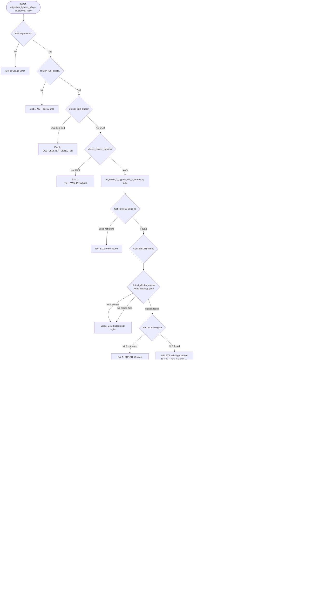
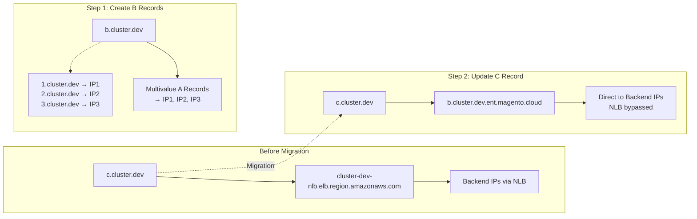
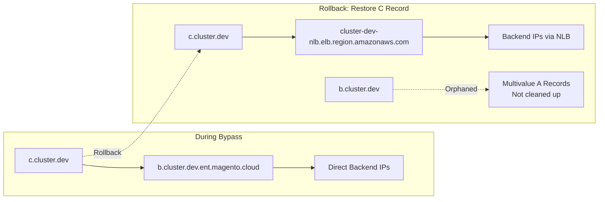
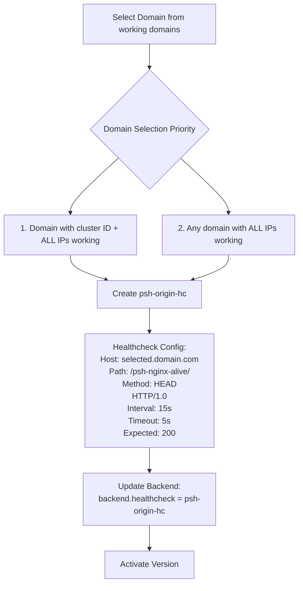
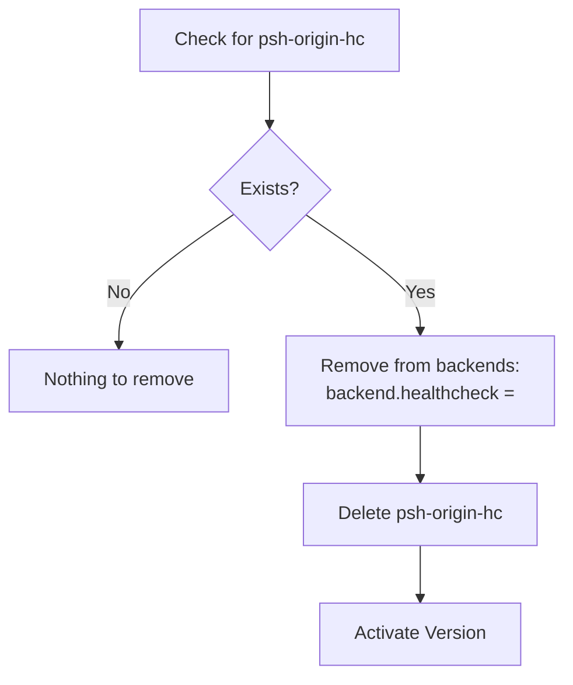

# Complete NLB Bypass Migration Flow

This diagram shows the **complete end-to-end flow** of the NLB bypass migration including all validation checks, exit points, DNS operations, and Fastly changes across all scripts.

## Forward Migration Flow (bypass_nlb = true)

## Rollback Flow (bypass_nlb = false)

## DNS State Changes

### Forward Migration DNS Flow

### Rollback DNS Flow

## Fastly Healthcheck Configuration

### Forward: Add Healthcheck

### Rollback: Remove Healthcheck

## All Exit Points and Error Messages

| Exit Point | Script | Error Message | Tracked by report2.py |
|------------|---------|---------------|----------------------|
| **DG3 Detection** | migration_bypass_nlb.py | `DG3_CLUSTER_DETECTED` | ✅ DG3_CLUSTER_DETECTED |
| **Not AWS** | migration_bypass_nlb.py | `NOT_AWS_PROJECT` | ✅ NOT_AWS_PROJECT |
| **No Topology** | migration_bypass_nlb.py | `ERROR_NO_TOPOLOGY_FILE` | ✅ ERROR_NO_TOPOLOGY_FILE |
| **No Provider** | migration_bypass_nlb.py | `ERROR_NO_PROVIDER` | ✅ ERROR_NO_PROVIDER |
| **Service Not Found** | fastly_healthcheck.py | `❌ Fastly Error: Service 'X' not found` | ✅ SERVICE_NOT_FOUND |
| **No Active Version** | fastly_healthcheck.py | `❌ Fastly Error: No active version found for service` | ✅ NO_ACTIVE_VERSION |
| **Backend Mismatch** | fastly_healthcheck.py | `ERROR: No backend found with expected hostname` | ✅ BACKEND_NOT_FOUND |
| **No Backend IPs** | fastly_healthcheck.py | `ERROR: Could not determine backend IPs` | ✅ BACKEND_UNRESOLVABLE |
| **No Working Domains** | fastly_healthcheck.py | `No working domains found` | ✅ NO_DOMAINS |
| **Healthcheck Test Fail** | migration_bypass_nlb.py | `ERROR: Healthcheck test failed:` | ❌ **MISSING** |
| **DNS Zone Not Found** | migration_1/2 | `ERROR: Zone magento.cloud. not found` | ❌ **MISSING** |
| **DNS Resolution Fail** | migration_1 | `ERROR: Failed to resolve hostname` | ❌ **MISSING** |
| **B Record Missing** | migration_2 | `ERROR: Cannot bypass NLB: b record doesn't exist` | ❌ **MISSING** |
| **NLB Not Found** | migration_2 | `ERROR: Cannot use NLB: NLB not found` | ❌ **MISSING** |
| **Route53 API Error** | migration_1/2 | `ERROR: Failed to update DNS` | ❌ **MISSING** |
| **Fastly API Error** | fastly_healthcheck.py | `Error creating healthcheck:` | ❌ **MISSING** |

## Critical Validation Points

### Pre-Migration Checks (All must pass)
1. ✅ HIERA_DIR exists
2. ✅ Not a DG3 cluster  
3. ✅ AWS provider
4. ✅ Fastly service exists
5. ✅ Fastly backend matches cluster
6. ✅ At least one domain works with ALL backend IPs
7. ✅ Route53 zone accessible
8. ✅ Backend IPs resolvable

### During Migration (Atomic operations)
1. **DNS Step 1**: Create B records (forward only)
2. **DNS Step 2**: Update C record  
3. **Fastly Step 3**: Add/Remove healthcheck

### Rollback Differences
- ❌ Skips: Backend validation, healthcheck test, B record creation
- ✅ Requires: NLB discovery, region detection
- ⚠️  Limitation: B records are orphaned (not cleaned up)

## State Consistency

### Success State (Forward)
- `c.cluster.dev` → `b.cluster.dev.ent.magento.cloud` 
- `b.cluster.dev.ent.magento.cloud` → Backend IPs (multivalue)
- Fastly backend uses `psh-origin-hc` healthcheck
- Traffic flows: Client → Fastly → Backend IPs (no NLB)

### Success State (Rollback)
- `c.cluster.dev` → `cluster-dev-nlb.elb.region.amazonaws.com`
- Fastly backend has no healthcheck
- Traffic flows: Client → Fastly → NLB → Backend IPs
- Orphaned: `b.cluster.dev` records remain

### Failure States
Any exit point leaves the system in previous state (no partial changes within each script, but cross-script failures can leave inconsistent state).
